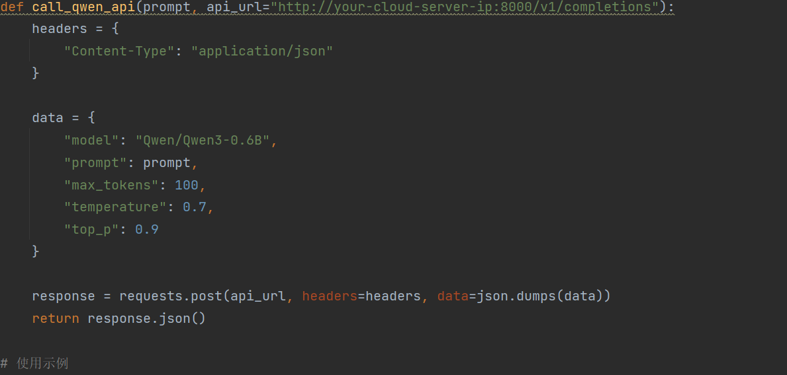

### twz10.05日报

使⽤ VLLM 框架部署 Qwen3-0.6B 模型, 模型需要⽀持 RestFul 接⼝的调⽤
4.1 qwen 模型使⽤ 2 种⽅式进⾏部署分别是基于 CPU 和 GPU 运⾏
4.2 qwen 模型使⽤云端进⾏部署, 开放远程调⽤的 callback
4.3 qwen 模型需要微调, 使⽤ LoRA 框架预先训练数据集, 针对地址信息进⾏调整, 数据处理使⽤ PySpark
>