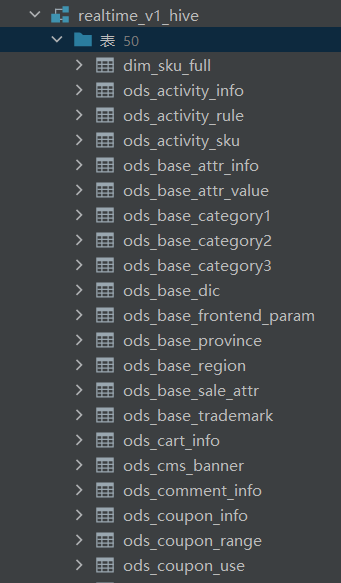

#### 唐文柱11.19日报

1,同步数据
>

2,写dim层
DROP TABLE IF EXISTS dim_sku_full;
CREATE EXTERNAL TABLE dim_sku_full
(
`id`                   STRING COMMENT 'SKU_ID',
`price`                DECIMAL(16, 2) COMMENT '商品价格',
`sku_name`             STRING COMMENT '商品名称',
`sku_desc`             STRING COMMENT '商品描述',
`weight`               DECIMAL(16, 2) COMMENT '重量',
`is_sale`              BOOLEAN COMMENT '是否在售',
`spu_id`               STRING COMMENT 'SPU编号',
`spu_name`             STRING COMMENT 'SPU名称',
`category3_id`         STRING COMMENT '三级品类ID',
`category3_name`       STRING COMMENT '三级品类名称',
`category2_id`         STRING COMMENT '二级品类id',
`category2_name`       STRING COMMENT '二级品类名称',
`category1_id`         STRING COMMENT '一级品类ID',
`category1_name`       STRING COMMENT '一级品类名称',
`tm_id`                  STRING COMMENT '品牌ID',
`tm_name`               STRING COMMENT '品牌名称',
`sku_attr_values`      ARRAY<STRUCT<attr_id :STRING,
value_id :STRING,
attr_name :STRING,
value_name:STRING>> COMMENT '平台属性',
`sku_sale_attr_values` ARRAY<STRUCT<sale_attr_id :STRING,
sale_attr_value_id :STRING,
sale_attr_name :STRING,
sale_attr_value_name:STRING>> COMMENT '销售属性',
`create_time`          STRING COMMENT '创建时间'
) COMMENT '商品维度表'
PARTITIONED BY (`dt` STRING)
STORED AS ORC
LOCATION '/warehouse/gmall/dim/dim_sku_full/'
TBLPROPERTIES ('orc.compress' = 'snappy');

with
sku as
(
select
id,
price,
sku_name,
sku_desc,
weight,
is_sale,
spu_id,
category3_id,
tm_id,
create_time
from ods_sku_info
where create_time='2022-06-08'
),
spu as
(
select
id,
spu_name
from ods_spu_info
where create_time='2022-06-08'
),
c3 as
(
select
id,
name,
category2_id
from ods_base_category3
where create_time='2022-06-08'
),
c2 as
(
select
id,
name,
category1_id
from ods_base_category2
where create_time='2022-06-08'
),
c1 as
(
select
id,
name
from ods_base_category1
where create_time='2022-06-08'
),
tm as
(
select
id,
tm_name
from ods_base_trademark
where create_time='2022-06-08'
),
attr as
(
select
sku_id,
collect_set(named_struct('attr_id',attr_id,'value_id',value_id,'attr_name',attr_name,'value_name',value_name)) attrs
from ods_sku_attr_value
where create_time='2022-06-08'
group by sku_id
),
sale_attr as
(
select
sku_id,
collect_set(named_struct('sale_attr_id',sale_attr_id,'sale_attr_value_id',sale_attr_value_id,'sale_attr_name',sale_attr_name,'sale_attr_value_name',sale_attr_value_name)) sale_attrs
from ods_sku_sale_attr_value
where create_time='2022-06-08'
group by sku_id
)

insert overwrite table dim_sku_full partition(dt='2022-06-08')
select
sku.id,
sku.price,
sku.sku_name,
sku.sku_desc,
sku.weight,
sku.is_sale,
sku.spu_id,
spu.spu_name,
sku.category3_id,
c3.name,
c3.category2_id,
c2.name,
c2.category1_id,
c1.name,
sku.tm_id,
tm.tm_name,
attr.attrs,
sale_attr.sale_attrs,
sku.create_time
from sku
left join spu on sku.spu_id=spu.id
left join c3 on sku.category3_id=c3.id
left join c2 on c3.category2_id=c2.id
left join c1 on c2.category1_id=c1.id
left join tm on sku.tm_id=tm.id
left join attr on sku.id=attr.sku_id
left join sale_attr on sku.id=sale_attr.sku_id;

DROP TABLE IF EXISTS dim_coupon_full;
CREATE EXTERNAL TABLE dim_coupon_full
(
`id`                  STRING COMMENT '优惠券编号',
`coupon_name`       STRING COMMENT '优惠券名称',
`coupon_type_code` STRING COMMENT '优惠券类型编码',
`coupon_type_name` STRING COMMENT '优惠券类型名称',
`condition_amount` DECIMAL(16, 2) COMMENT '满额数',
`condition_num`     BIGINT COMMENT '满件数',
`activity_id`       STRING COMMENT '活动编号',
`benefit_amount`   DECIMAL(16, 2) COMMENT '减免金额',
`benefit_discount` DECIMAL(16, 2) COMMENT '折扣',
`benefit_rule`     STRING COMMENT '优惠规则:满元*减*元，满*件打*折',
`create_time`       STRING COMMENT '创建时间',
`range_type_code`  STRING COMMENT '优惠范围类型编码',
`range_type_name`  STRING COMMENT '优惠范围类型名称',
`limit_num`         BIGINT COMMENT '最多领取次数',
`taken_count`       BIGINT COMMENT '已领取次数',
`start_time`        STRING COMMENT '可以领取的开始时间',
`end_time`          STRING COMMENT '可以领取的结束时间',
`operate_time`      STRING COMMENT '修改时间',
`expire_time`       STRING COMMENT '过期时间'
) COMMENT '优惠券维度表'
PARTITIONED BY (`dt` STRING)
STORED AS ORC
LOCATION '/warehouse/gmall/dim/dim_coupon_full/'
TBLPROPERTIES ('orc.compress' = 'snappy');

insert overwrite table dim_coupon_full partition(dt='2022-06-08')
select
id,
coupon_name,
coupon_type,
coupon_dic.dic_name,
condition_amount,
condition_num,
activity_id,
benefit_amount,
benefit_discount,
case coupon_type
when '3201' then concat('满',condition_amount,'元减',benefit_amount,'元')
when '3202' then concat('满',condition_num,'件打', benefit_discount,' 折')
when '3203' then concat('减',benefit_amount,'元')
end benefit_rule,
create_time,
range_type,
range_dic.dic_name,
limit_num,
taken_count,
start_time,
end_time,
operate_time,
expire_time
from
(
select
id,
coupon_name,
coupon_type,
condition_amount,
condition_num,
activity_id,
benefit_amount,
benefit_discount,
create_time,
range_type,
limit_num,
taken_count,
start_time,
end_time,
operate_time,
expire_time
from ods_coupon_info
where create_time='2022-06-08'
)ci
left join
(
select
dic_code,
dic_name
from ods_base_dic
where create_time='2022-06-08'
and parent_code='32'
)coupon_dic
on ci.coupon_type=coupon_dic.dic_code
left join
(
select
dic_code,
dic_name
from ods_base_dic
where create_time='2022-06-08'
and parent_code='33'
)range_dic
on ci.range_type=range_dic.dic_code;